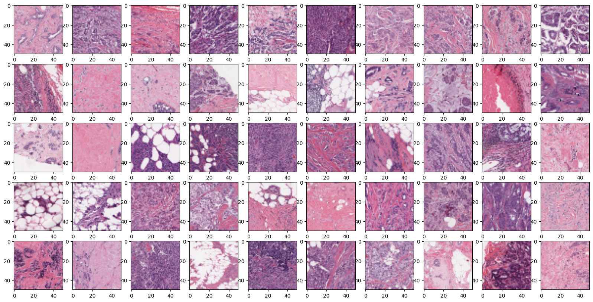
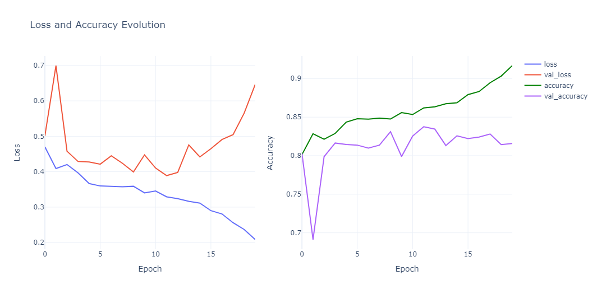
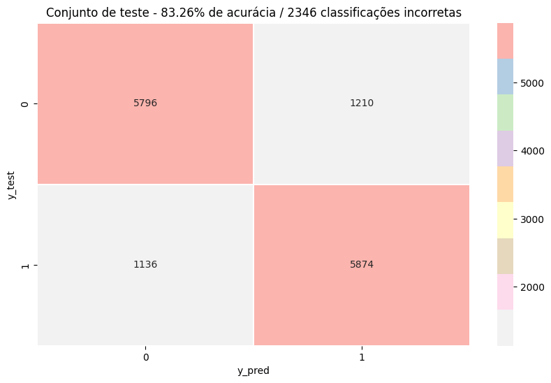
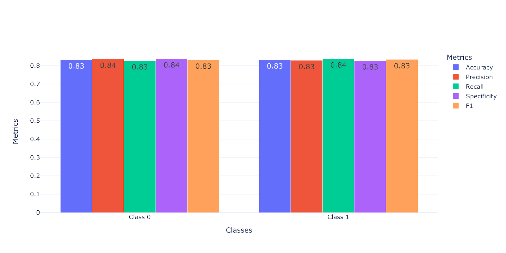
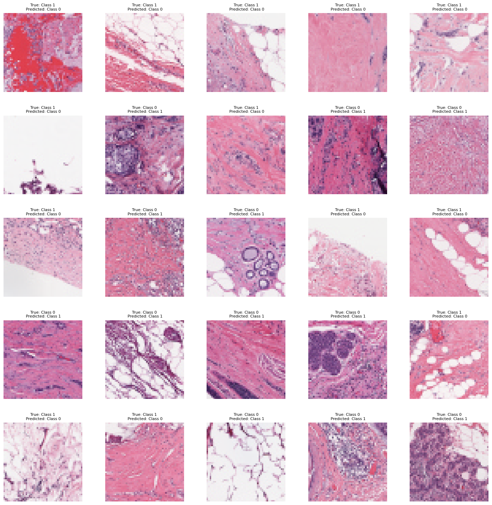
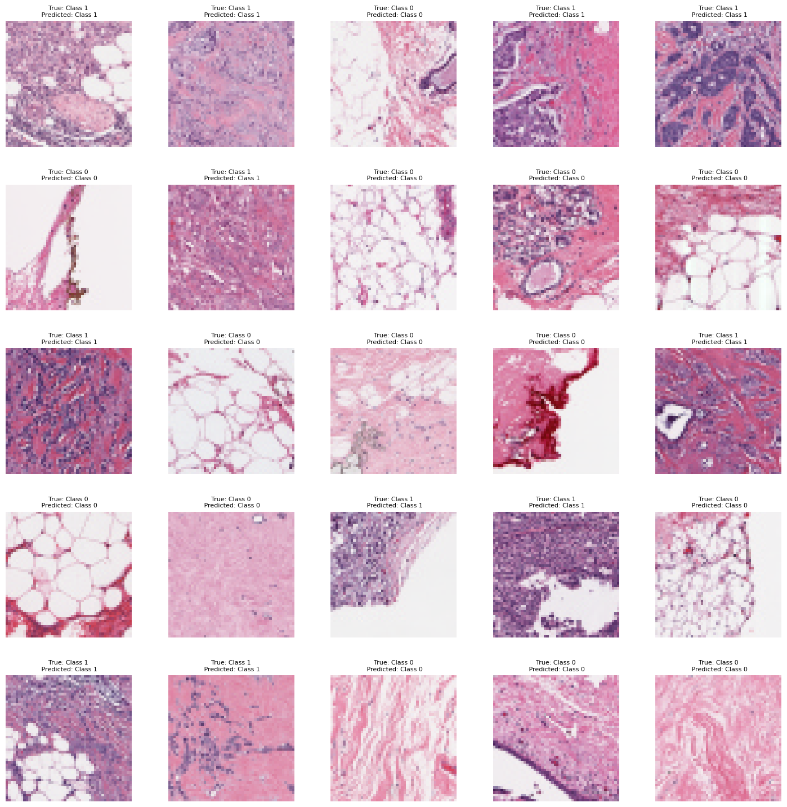

<h1> Project:  Histopathology breast cancer image classification using supervised learning</h1>

<h1> Projeto: Classificação de imagens histopatológicas de câncer de mama usando aprendizado supervisionado</h1>

This project originated in the context of the activities of the postgraduate discipline Health Data Science and Visualization, offered in the first half of 2023, at Unicamp 

| Name | RA | Specialization |
| -------- | -------- | -------- |
| Natalia Gil Canto  | 232881  | Electrical and Computing Engineering  |
| Sadeeq Olalekan Bello  | 198346  | Computing - Leader Github - Lekzyboi |
| Temitope Kola Adebowale | 256247 | Computing  |
| Suelen Aparecida Ribeiro de Souza  | 252483 | FCM |

# Final Presentation Slide
HISTOPATHOLOGY BREAST CANCER [Drive Link](https://docs.google.com/presentation/d/169Uxc4ZzKnGlALwkBuwg54oSCp8PxMzT/edit?usp=sharing&ouid=115190221092782416253&rtpof=true&sd=true)
[Github Link](https://github.com/datasci4health/projects2023/raw/main/Group6/docs/Final_Presentation.pdf)

# Introduction and Theoretical References

Breast cancer is the most common type of cancer among women worldwide, with 2.3 million cases recorded in 2020. It is also one of the leading causes of death among women in Brazil. The majority of cases, 80 to 90% of them, represent invasive ductal carcinoma. Studies show that women over 40 years old are more prone to develop and die from breast cancer (Ministry of Health, 2022).
When the diagnosis is made in the early stages of the disease, the chances of cure and the possibility of choosing the most appropriate treatment are higher, with approximately a 95% chance of cure for patients. Histopathological images are considered the gold standard for breast cancer presenting variable characteristics, making the early diagnosis a challenge and late diagnosis can increase the chances of death even when the tumor is not aggressive. Erroneous diagnoses with false-negative results also pose significant risks to patients (Jaroensri et al., 2022).
During a breast examination, if there are indications of a tumor or significant abnormalities, a biopsy is performed, in which a small amount of tissue is collected. Subsequently, the tissue undergoes a process that includes fixation, embedding, sectioning, mounting on slides, and staining with hematoxylin and eosin. To analyze the slides, it is necessary to manually identify the affected or altered regions. Currently, there is a high demand for histopathological analyses, but the availability of qualified pathologists is disproportionate. The training of a pathologist with sufficient knowledge and experience to detect cancer in the early stages and choose the best treatment for the patient requires a lot of time and effort, which does not align with the increasing incidence of breast cancer (Aksac et al., 2019). With advances in research and the use of technologies, it is expected that breast cancer detection will become increasingly early, allowing for the use of more targeted treatments and thus saving more lives (Aksac et al., 2019; NIH, 2022).
Artificial intelligence technologies, such as machine learning and deep learning have neural networks that, when given an input image, perform a series of operations, learning parameters to perform tasks such as segmentation, regression and classification. When applied to the healthcare field, especially in the analysis of medical images, these technologies can accelerate and improve the quantitative and qualitative evaluation of histological images, assisting pathologists and reducing the need for laborious manual analysis of slides. However, the results still need to be validated by the professional (Hamidreza et al., 2020; Mercan et al., 2022). However, one of the challenges for the application of these tools in clinical practice is understanding their utility in the workflow and day-to-day reality of pathology (Jaroensri et al., 2022)
In this project, we utilized histological images of invasive ductal carcinoma stored in the Kaggle database. The dataset was achieved through Whole Slide Imaging (WSI), which is a technology that digitizes entire histological or cytological tissue slides, allowing high-resolution imaging of the entire glass slide. It replaces conventional microscopy by capturing detailed images of the tissue or cells. These digital images can be stored, viewed, and analyzed on a computer, offering benefits such as remote access, easy sharing for consultation, and computational analysis capabilities. WSI aims to enhance diagnostic pathology by improving accessibility, collaboration, and efficiency in the interpretation of slide specimens.
The entire slide images, scanned at 40x magnification, were divided into 50x50 image patches. Out of the 277.524 patches, 198.738 are negative for IDC (-), meaning they exhibit characteristics of normal breast tissue, while 78.786 are classified as positive for IDC (+), indicating characteristics of cancer-affected tissue (Kaggle, 2018). 
Using the information provided, we conducted an exploratory analysis of the dataset to gain a deeper understanding and extract valuable insights for the project's next steps. Based on that, we applied a supervised learning-based classification model to the data, enabling us to obtain insightful metrics based on accurate and inaccurate classifications. This process involved meticulously examining the behavior of the data, which not only provided valuable insights but also paved the way for future work.

# Research Questions
* Research question: Can supervised learning be used to identify specific features or patterns in histopathology images that are indicative of breast cancer? 

# General objective
To evaluate the effectiveness of a supervised learning-based image classification model in detecting breast cancer on histopathology images.

# Specific objectives
To evaluate the performance of an image classification model on histopathology images using different metrics: accuracy, recall, specificity, f1-score and precision;
To analyze the model’s incorrect and correct classifications to get insights into its behavior;
Propose improvements on the model’s learning process and future work. 

# Methodology

# Dataset Collection and Preparation
Our dataset was generated using Whole Slide Imaging (WSI) - a cutting-edge technology that digitizes complete histological or cytological tissue slides to provide high-resolution images. This method has revolutionized traditional microscopy by capturing comprehensive and detailed representations of tissue or cell structures.

The specific dataset employed in this project consisted of Breast Histopathology Images, extracted from 279 unique patients. In total, we had 277,524 patches, each of the size 50x50 pixels. Among these patches, 198,738 were Invasive Ductal Carcinoma (IDC) negative, and 78,786 were IDC positive. By leveraging the dataset at the level of individual patches, we were able to reconstruct the histological structures of the tissues.

# Model Selection and Preprocessing
For the classification task, we chose EfficientNetV2S, a renowned image classification model available within the Keras library. This model promises an optimal balance between accuracy and training time and typically performs excellently on mid-sized to large datasets.

Our dataset was partitioned into training (70%), validation (15%), and testing (15%) sets. Importantly, we ensured that the split was performed at the patient level to prevent the mixing of patches from the same patient across different sets. To address the class imbalance, we truncated the data to achieve an equal number of instances from each class in all subsets. Due to computational constraints, the dataset was further reduced by 50%.

### The initial distribution of the data was as follows:

* Training set: 142,774 class 0 instances and 55,437 class 1 instances
* Validation set: 23,903 class 0 instances and 9,296 class 1 instances
*Testing set: 32,061 class 0 instances and 14,053 class 1 instances

### After preprocessing, we achieved a balanced distribution:

* Training set: 27,718 instances for both classes
* Validation set: 4,648 instances for both classes
* Testing set: 7,026 instances for both classes
* By utilizing a robust dataset, a high-performing model, and meticulous preprocessing techniques, we developed a methodology designed to optimize the performance of our classifier on this specific task.

# Databases and Evolution

##  Database Studied but not Adopted
| Database | Web Address| Descriptive Summary |
| -------- | -------- | -------- |
| Human Against Machine (HAM10000) | [Link](https://www.kaggle.com/datasets/surajghuwalewala/ham1000-segmentation-and-classification?datasetId=1370616)  |  A large collection of multi-source dermatoscopic images of common pigmented skin lesions|

### Descriptive Summary - 
A large collection of multi-source dermatoscopic images of common pigmented skin lesions.

This dataset consists of 10,000 sample images with six different classes of skin lesions, they are Actinic keratoses and intraepithelial carcinoma / Bowen's disease (AKIEC), basal cell carcinoma (BCC), benign keratosis-like lesions (solar lentigines / seborrheic keratoses and lichen-planus like keratoses, BKL), dermatofibroma (DF), melanoma (MEL), melanocytic nevi (NV), vascular lesions (angiomas, angiokeratomas, pyogenic granulomas and haemorrhage, VASC). 

All the datasets can be accessed through two main files. The first is composed of the images in .jpg format and the second is a .csv file that contains the image's names and the classes per image. Some examples of the structure of the data can be seen in the image below.

During the exploratory data analysis, it was discovered that the classes are imbalanced, this was an interesting observation since the first idea of the project was to explore different data augmentation techniques on the health image dataset. However, the initial proposal was adapted to a scenario where we can have an insightful contribution from the health specialist in the team, and also,  based on the analysis of the problem itself, we concluded that in a daily routine, it wouldn't be a very useful tool for a doctor to work with. Therefore, this dataset was discarded.

# Analysis of the Adopted Dataset
##  Database Studied and Adopted

| Database | Web Address| Descriptive Summary |
| -------- | -------- | -------- |
| Breast Histopathology Images | [Link](https://www.kaggle.com/datasets/paultimothymooney/breast-histopathology-images)  |  Invasive Ductal Carcinoma (IDC) tissue regions in slide images (WSI) of breast cancer |

* The original dataset consists of 162 whole-mount slide images of Breast Cancer (BCa) specimens scanned at 40x. From that, 277,524 patches of size 50 x 50 were extracted (198,738 IDC negative and 78,786 IDC positive). 
* Each patch’s file name is of the format: u_xX_yY_classC.png: e.g., 10253_idx5_x1351_y1101_class0.png. 
* Where u is the patient ID (10253_idx5), X is the x-coordinate of where this patch was cropped from, Y is the y-coordinate of where this patch was cropped from, and C indicates the class where 0 is non-IDC and 1 is IDC. From the patient ID, we could observe that 279 patients are present on the dataset. Below we can see some examples from each class.

### Class 1

### Class 0

                                                                                    
To understand these images, we can proceed with a more detailed analysis of the problem and its main characteristics:

There are various types of dyes used in histology. However, for the analysis of biopsies aiming to evaluate the presence of abnormal cells in the examined tissue, the Hematoxylin-Eosin (HE) staining is the most commonly employed. Hematoxylin at the molecular level has a basic characteristic. This dye stains in a bluish-purple colour, thereby highlighting cellular structures with acidic or basophilic characteristics, such as deoxyribonucleic acid (DNA) and parts of the endoplasmic reticulum. On the other hand, Eosin dye has an acid characteristic and stains basic regions, also known as acidophilic regions, such as the cytoplasm and mitochondria (Abrahamsohn; Freitas, 2004). These characteristics can be observed on the patches explored and will be very important in the next analysis.

Firstly, when breast cancer is detected early on, there is approximately a 95% chance of a cure. Histopathological images are considered the gold standard for diagnosing breast cancer; however, the histological technique and analysis are artisanal processes, and the interpretation of these images is time-consuming and can vary from one professional to another, depending on their experience (Brancati et al., 2022). There is also the risk of misdiagnosis, which can have serious consequences for the patient. Currently, there is a high demand for histological analysis that outweighs the number of skilled pathologists available. 

To be able to analyze and identify abnormal regions affected by the tumour, it is necessary to have a good understanding of the morphology, i.e., the shape of healthy cells and the normal composition of the organ being analyzed. 

In recent years, deep learning has gained prominence in this field for pattern recognition and efficient execution of various tasks (Cruz-Rhoa et al., 2014). The shape of cells follows a pattern according to the organ and function they possess. As cells deviate from this pattern and continue to multiply, they accumulate mutations and become increasingly different from the healthy cells from which they originated. The accumulation of mutations is classified as neoplasia, and the more these different cells multiply, the more aggressive the tumour becomes. Invasive ductal adenocarcinoma accounts for almost 80% of all breast cancer cases.

The tumour formed by clusters of neoplastic cells stimulates fibroblasts, which in turn produce the production of collagen fibres, leading to a desmoplastic reaction, visually identified by groups of cells arranged in rows. The clustering of mutated cells presents a cribriform appearance and visually resembles a sieve. The peripheral regions containing clustered white circular structures are adipose tissue cells, commonly known as fat-storing cells. Invasive ductal adenocarcinoma tends to expand into adipose tissue, and this event is related to the malignancy of the tumour (Aquino et. al., 2017). Cellular masses can also be observed in blood vessels and lymphatics, known as emboli. This event indicates that the tumour is seeking to invade regions beyond the breast, also known as metastasis. Veins can be identified by a ring lined with a thin layer of muscle cells (thin and elongated cells). 

In normal tissue, lymph nodes are important nodules for filtering and removing harmful substances from that region. Visually, they are identified as clusters of immune system cells. 
It is also possible to identify, in certain images, the presence of mammary glands with a flower-like shape, surrounded by a layer of cells (Anatpat, 2023). 

In addition to the mentioned findings, it is possible to locate lymphocytes, which are immune system cells and have slightly larger nuclei than the cells present in the breast. Mitoses, the events in which a cell multiplies through cell division, are also present. In these cases, cells have a denser nucleus and, in some instances, an elongated shape (Anatpat, 2023). 

From the first plot, we can observe a high variation in the number of patches per patient, with a mean of around 1000. This observation makes us think that, if the patches are the same size (50x50) per patient and the total number is still different, maybe the full images per patient have different sizes or some data is missing. However, at the moment, we believe that this is not a problem since the classification models are going to work with the patches as input, but, we do agree that we need to be careful about preserving data from the same patient in the same set (e.g., train, validation and test sets).

From the second plot, we can also see variations between the percentage of cancer cells on the images, with a mean of around 20%, this is important for us because from that we can assume that most of the images from the dataset contain more healthy cells than cancer cells, which correlates to the last plot that will be discussed in the sequence. 

From the third plot, we can get how much data from classes 0 or 1 are present on the dataset, and, based on that, we can clearly see we have an imbalance between them, which requires the decision of how we are going to deal with this type of scenario since this could cause problems on the learning process of the classification models. To deal with that, we have some options: apply data augmentation techniques to increase the samples from class 1; truncate the samples from class 0; or, make some adjustments on both at the same time. The implications related to each option will be evaluated later.

Also, the figure below shows some examples from the dataset for 6 different patients. Each image is composed of patches from that patient that are related to class 0 (pink circles) and 1 (blue circles). From that, we can confirm some of the insights we had from the plots above, that are: just a small percentage of the images contains cancer cells, and most of them are healthy cell, which justifies the classes being imbalanced; also, we can clearly see differences on the number of patches per patients since the x-y axis have different total numbers and the circles from the plots may appear in different distances from each other, which highlights that some patients may have images with different sizes or that are some missing patches per patient

# Tools

Python
* Python, a powerful and flexible programming language, was used as the primary coding language for this project. Due to its simplicity and versatility. Python's diverse range of libraries and frameworks allowed us to implement advanced machine-learning algorithms efficiently.

* TensorFlow and Keras
TensorFlow was utilized for building and training the machine learning model. TensorFlow offers a comprehensive and flexible platform for machine learning and is renowned for its performance and capabilities in handling large-scale neural networks. Keras was used in conjunction with TensorFlow. It provides a simpler mechanism to express neural networks. Keras also supports multiple back-end neural network computation engines, including TensorFlow.

* EfficientNetV2S
Within Keras, we utilized EfficientNetV2S, a pre-existing image classification model. The model promises a balanced compromise between computational efficiency and model accuracy, making it an ideal choice for our image classification task.

* SciKit-Learn
The Scikit-learn library was employed for various tasks, including data preprocessing, and performance metric evaluation.

* Throughout the research project, we leveraged a variety of software tools and programming libraries. These technologies were chosen because they are widely recognized and employed in the field of machine learning and data analysis.

* Pandas and NumPy
Pandas was used for handling and preprocessing our dataset. NumPy, another library for the Python programming language, was used to handle numerical operations efficiently.

* Matplotlib and Seaborn
For visualizations, we used Matplotlib, a plotting library for Python, and Seaborn, a Python data visualization library based on Matplotlib. They offer a wide range of sophisticated visualization tools that allowed us to effectively visualize our data and model results.

* ImageDataGenerator
Keras's ImageDataGenerator was used to perform real-time data augmentation. It configures random transformations and normalization operations to be done on our image data during training, aiding the generalization capability of our model.

By combining these robust, versatile tools, we developed a comprehensive approach that allowed us to effectively explore, process, model, and evaluate our data.

# Results

To evaluate the results achieved by EfficientNetV2S we have first plotted the loss and accuracy evolution, which can be seen below. Firstly, from the loss evolution, we can see both validation and training curves decreasing through the epochs, especially after the 2nd epoch, followed by an increase after the 15th epoch on the validation curve. Secondly, the evolution from the training and validation accuracy can also be observed after the 2nd epoch and keeps increasing until the last epoch.

Since the training of such a big dataset is very time-consuming, we have decided to stop the training in 20 epochs, however, we do agree the accuracy and loss evolution was still showing progress, which may be indicative of better learning after the 20th epoch, which could produce better generalizability for the model on the test set. This decision is going to be highlighted in the next sections.

Based on that, the trained model was applied to the test set, which contained samples of the dataset that were not previously seen by the classifier. On the test, the model could correctly classify the images with an accuracy of 83.26% and its confusion matrix can be seen below.

From the results obtained, it is evident that the model made 2,346 incorrect classifications and 11,670 correct classifications. In the medical context, evaluating the false negatives produced by the classifier is crucial as they represent instances where the model failed to identify breast cancer in the tissue despite its presence. Notably, there were a significant number of false negatives, amounting to 1,136, which is comparable to the number of false positives, totalling 1,210. However, considering the overall sample size of the test set, which was 14,016, it can be concluded that the model demonstrated a certain level of proficiency in learning the primary patterns indicative of breast cancer.

Below, we can observe some metrics that were evaluated based on the confusion matrix for both classes. Firstly, the obtained precision indicates that the model has a relatively low rate of false positive classifications, meaning that it is generally accurate in identifying positive cases of breast cancer. Secondly, the recall value suggests that the model has a reasonable ability to capture true positive instances of breast cancer, indicating a decent level of sensitivity. The specificity value signifies that the model has a moderate capability to correctly identify true negative cases, while the F1-score, which considers both precision and recall, indicates a balance between the model’s ability to accurately classify both positive and negative instances. Lastly, the accuracy value, which represents the overall correctness of the model’s predictions, reflects a satisfactory level of performance in distinguishing between breast cancer and non-breast cancer tissues, as was highlighted previously.

In summary, the precision, recall, specificity, accuracy and f1-score present similar behavior, indicating the model presents consistent performance metrics around 83% for both classes indicating an interesting level of effectiveness in classifying breast cancer tissues on the given dataset.

From the results obtained and analyzed in the previous section, we have observed the effectiveness of a supervised learning-based classification model in classifying and identifying patterns on the patches that are, indeed, related to breast cancer. 

From the point of view of machine learning, we can also agree the model explored is very capable of learning these types of information and that, even though we did not explore the most robust techniques (e.g., transfer learning), it could learn and predict on most of the samples we have.

We can also highlight some of the misclassifications the model made to observe and discuss, to some extent, its behaviour on the test set.

### 

When analyzing the patches, it was possible to observe that those displaying half in white and half containing tissue were classified as 0, indicating the absence of neoplasia, even when the tissue in question belonged to class 1. Furthermore, tissues with few differentiated cells, light colouration, and scar tissue were also categorized as class 0 by the model. Similarly, when the tissue exhibited intense colouration and a significant amount of adipocytes (circular structure with white interior), the model also classified it as class 0.

On the other hand, there was an interesting observation when the tissue had a deep purple colouration. In such cases, even without signs of abnormality, in the image, the model classified it as class 1. However, it is important to note that the intensity of colouration can vary depending on the technique and method used by the professional, as well as the time taken to process the samples. Additionally, factors such as the brand of dyes used can significantly influence the final result of the colourations. The areas in red possibly indicate an excess of dye, either due to high concentration or when the slide remains immersed in the staining solution for longer than recommended by the manufacturer.

Therefore, it is crucial to consider these nuances when interpreting the model’s results. Incorrect classification of tissues with intense colouration as class 1, even in the absence of abnormalities, could lead to misdiagnosis. Hence, it is necessary to carefully evaluate the histological techniques employed and consider the possibility of variations and subjectivity in the interpretation of the images.
Furthermore, accurate identification and classification of tissues are essential to ensure the accuracy of diagnosis and provide appropriate treatment to patients. Therefore, the involvement of experienced pathologists who can analyze and interpret the results provided by the model, while considering the complete clinical context of the patients, is essential.

In a tissue region where there is a presence of cells with larger nuclei, such as lymphocytes, there may be some local inflammatory process or response from the organism’s immune system, which would justify the accumulation of these cells. Such accumulation could also indicate the presence of carcinoma in the region. When analyzing the model, it classified these patches as positive, demonstrating that the model made accurate classifications. Additionally, patches with an abundance of adipocytes were also classified as negative, and in these cases, the model also made accurate classifications. Additionally, the patch containing artefacts, such as the grey field shown in the image set discussed in the topic ‘’Database Studies and Adopted’’, was correctly classified as negative. This outcome demonstrates the accuracy of the model.

# Conclusions

From the results and discussions we have made, we can positively answer the research question: can supervised learning be used to identify specific features or patterns in histopathology images that are indicative of breast cancer? 

We have observed, even though we are not using robust techniques nor exhaustive training, the classification model was capable of successfully concluding the desired task required. Still, we have room for improvement, which we are going to discuss in the next section.

From the point of view of the health sciences, even though the model is capable of appropriately classifying images it has never seen before, the presence of a qualified professional in the field is still highly important. This is because we are uncertain about the parameters that the model is considering when making decisions. It’s worth noting that the use of these techniques would not replace the work of pathologists, but rather shorten the time required for the manual analysis steps they need to perform.

Furthermore, the model has been shown to be influenced by colourations and specific characteristics of the images. Therefore, the final evaluation carried out by professionals is crucial to distinguish real cancer features from variations related to employed histological techniques and other subjectivities in image interpretation.

# Future work

* Comparing Different Models

To compare different models, several steps can be followed. Firstly, it is essential to select evaluation metrics that are suitable for the specific task and goals. Common metrics include accuracy, precision, recall, F1 score, and mean squared error (MSE). Secondly, the dataset should be divided into training, validation, and test sets. The training set is utilized for model training, the validation set helps in hyperparameter tuning and model selection, and the test set is used for final evaluation. Next, different models are implemented and trained using the training set. Their performance is then evaluated on the validation set using the chosen evaluation metrics. Finally, the results of the models are compared by analyzing their performance based on the evaluation metrics, taking into account factors such as accuracy, generalization capability, and computational efficiency. These steps provide a systematic approach to compare different models and make informed decisions.

* Increasing the Number of Epochs on the Training Set

 This is achieved by allowing the machine learning model to see the data more times during training. By doing so, the model has the potential to learn complex patterns more effectively. The process includes training the model with a reasonable number of epochs and monitoring its performance on a validation set. If the model's performance on the validation set continues to improve or reaches a plateau, it may benefit from additional training by increasing the number of epochs. Finally, after training with the increased number of epochs, the models are evaluated on a separate test set to obtain unbiased performance metrics, providing an objective assessment of their effectiveness.

 * Using Transfer Learning to Improve Generalization
 
 Transfer learning enables the use of  pre-trained models on large datasets such as ImageNet and fine-tuning them for specific tasks or domains. By leveraging the learned features from a pre-trained model, transfer learning can improve generalization and reduce the need for extensive training.

* Utilizing segmentation techniques for carcinoma detection

It involves dividing medical images into distinct and meaningful regions to identify and highlight areas that contain carcinoma. Thus, this is achieved by training a segmentation model, such as U-Net or Mask R-CNN, using annotated data where carcinoma regions are labelled or segmented. The trained model learns to identify and segment carcinoma regions within image patches. By applying the trained model to unseen patches, the specific areas containing carcinoma can be automatically highlighted. This enables visualization of the segmentation results and facilitates the identification and analysis of carcinoma regions within the patches

# References

Abrahamsohn, Paulo; Freitas, Vanessa. Histology: 1-23 Basic Concepts. Cellular and Development - Institute of Biomedical Sciences, University of São Paulo, 2004. Available at: https://mol.icb.usp.br/index.php/1-23-conceitos-basicos/.

Aksac A, Demetrick DJ, Ozyer T, et al. BreCaHAD: A dataset for breast cancer histopathological annotation and diagnosis. BMC Res Notes.2019;12:82.

Aquino, R. G. F. D., Vasques, P. H. D., Cavalcante, D. I. M., Oliveira, A. L. D. S., Oliveira, B. M. K. D., & Pinheiro, L. G. P. (2017). Invasive ductal carcinoma: the relationship between pathological characteristics and the presence of axillary metastasis in 220 cases. Rev. Col. Bras. Cir., 44(2), 163–170. doi:10.1590/0100-69912017002010.

Bolhasani H, Amjadi E, Tabatabaeian M, Jassbi SJ. A histopathological image dataset for grading breast invasive ductal carcinomas. Informatics in Medicine Unlocked. 2020;19:100341. 

Brancati N, Anniciello AM, Pati P, Riccio D, Scognamiglio G, Jaume G, De Pietro G, Di Bonito M, Foncubierta A, Botti G, Gabrani M, Feroce F, Frucci M. BRACS: A Dataset for BReAst Carcinoma Subtyping in H&E Histology Images. Database (Oxford). 2022 Oct 17;2022:baac093. doi: 10.1093/database/baac093. PMID: 36251776; PMCID: PMC9575967.

Couture HD, Williams LA, Geradts J, et al. Image analysis with deep learning to predict breast cancer grade, ER status, histologic subtype and intrinsic subtype. NPJ Breast Cancer.2018;4:30.

Cruz-Roa, A., Basavanhally, A., González, F., Gilmore, H., Feldman, M., Ganesan, S., … Madabhushi, A. (2014). Automatic detection of invasive ductal carcinoma in whole slide images with convolutional neural networks. Medical Imaging 2014: Digital Pathology. doi:10.1117/12.2043872
 
Ronneberger, O., Fischer, P., & Brox, T. (2015). U-Net: Convolutional networks for biomedical image segmentation. International Conference on Medical Image Computing and Computer-Assisted Intervention (MICCAI).

Jaroensri R, Wulczyn E, Hegde N, et al. Deep learning models for histologic grading of breast cancer and association with disease prognosis. NPJ Breast Cancer. 2022;8:113. 

Kaggle. Breast Histopathology Images. 2018. Available at: https://www.kaggle.com/datasets/paultimothymooney/breast-histopathology-images. Accessed April 28, 2023.

Mercan C, Balkenhol M, Salgado R, et al. Deep learning for fully-automated nuclear pleomorphism scoring in breast cancer. NPJ Breast Cancer. 2022;8:120. 

Ministry of Health. Concept and Magnitude. Brazil: INCA; 2022. Available at: https://www.gov.br/inca/pt-br/assuntos/gestor-e-profissional-de-saude/controle-do-cancer-de-mama/conceito-e-magnitude. Accessed May 6, 2023. 

National Cancer Institute. United States Government: NIH; 2022. Available at: https://www.cancer.gov/types/breast/research. Accessed May 6, 2023. 
 
UNICAMP. Department of Pathology Anatomy (Anatpat). Accessed on May 16, 2023. Available at: anatpat.unicamp.br.

